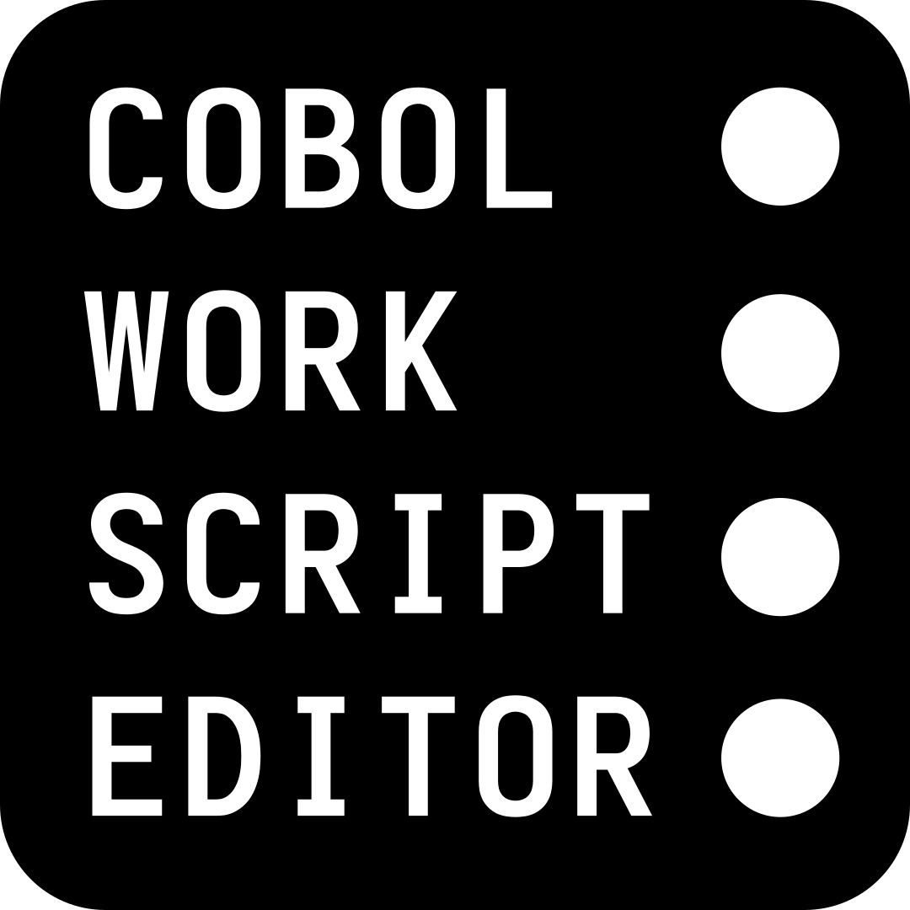
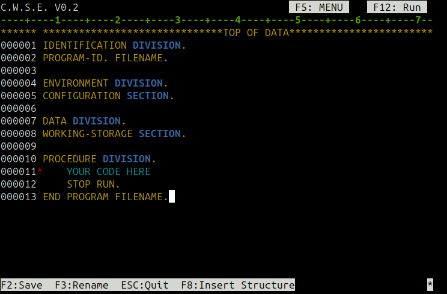

# Cobol Work Script Editor (CWSE) V0.2

A simple ncurses-based editor for COBOL scripts.

## Preview



## Terminal Compatibility

**Note:** CWSE may be unstable or have display issues with certain terminals, such as `gnome-terminal`.  
For best results, use [Sakura terminal](https://github.com/maehne/sakura) which has been tested and works reliably.

## Features

- Line-numbered editing for COBOL scripts
- Special comment column support
- Insert COBOL structure template
- Save, rename, and delete lines
- Keyboard navigation and shortcuts
- Visual highlighting for comments and code
- Tools/Help menu (F5) with scrollable COBOL reference (No feature yet implemented)
- Compilation errors shown in a scrollable popup
- Safe terminal clearing before and after COBOL execution
- Signal handling for clean exit (Ctrl+C)
- Insert at any position, filling with spaces if needed

## Installation

1. Ensure you have `gcc`, `libncurses`, **and [GnuCOBOL](https://gnucobol.sourceforge.io/)** installed.
2. Clone this repository:
   ```sh
   git clone https://github.com/yourusername/FAWC.git
   cd FAWC
   ```
3. Build the program:
   ```sh
   gcc app.c -o cwse -lncurses
   ```

## Usage

Run the editor with an optional filename:
```sh
./cwse [filename]
```
If the file does not exist, it will be created.

## Keyboard Shortcuts

| Key         | Action                        |
|-------------|------------------------------|
| F2          | Save file                    |
| F3          | Rename file                  |
| F5          | Open Tools/Help menu         |
| F8          | Insert COBOL structure       |
| F12         | Compile & run COBOL file     |
| ESC         | Quit                         |
| ↑/↓         | Move cursor up/down          |
| ←/→         | Move cursor left/right       |
| Enter       | Insert new line              |
| Backspace   | Delete character/line        |
| Delete      | Delete character/line        |
| TAB         | Insert 4 spaces              |
| Q           | Quit Tools/Help menu         |

## Tools/Help Menu (F5)

- Scrollable reference for COBOL picture clauses
- List of reserved words
- Usage tips and links
- Use UP/DOWN or j/k to scroll, Q to quit

## Compilation & Execution

- F12 saves, compiles, and runs the COBOL file
- Compilation errors are shown in a scrollable popup
- Terminal is cleared before and after execution for clarity

## Contributing

Pull requests and suggestions are welcome! Please open an issue for bugs or feature requests.

## License

This project is licensed under the MIT License.

## Credits

Developed by Ento9.
